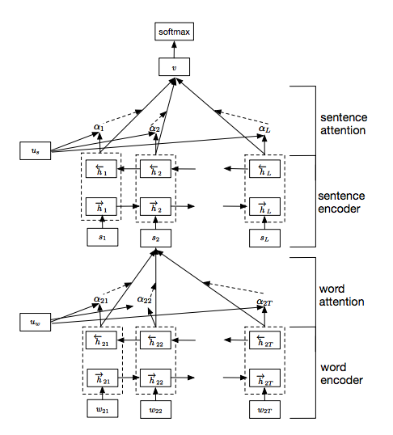
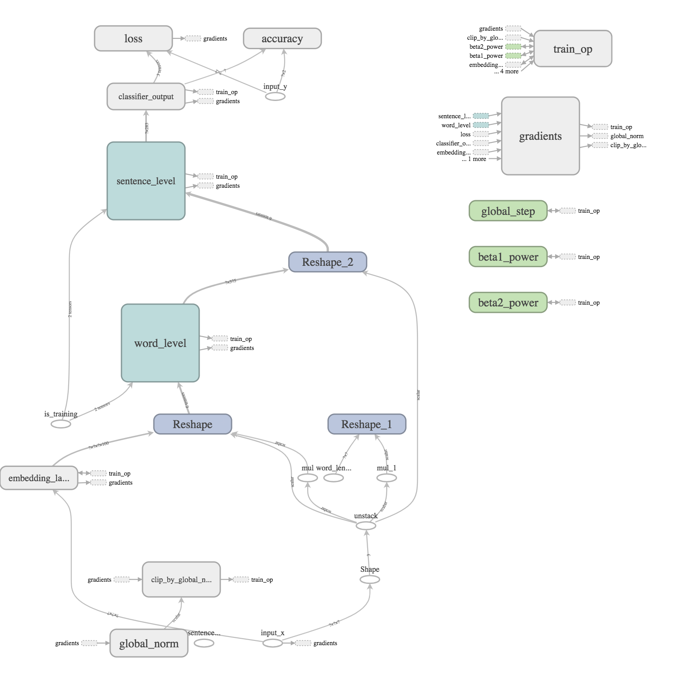
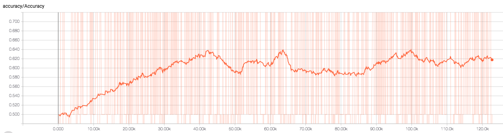
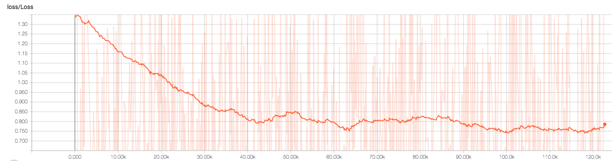

# Document Classification Comparisons featuring Hierarchical Attention Network

The [Hierarchical Attention Network](https://www.cs.cmu.edu/~diyiy/docs/naacl16.pdf) is a novel deep learning architecture that takes advantage of the hierarchical structure of documents to construct a detailed representation of the document. As words form sentences and sentences form the document, the Hierarchical Attention Network’s representation of the document uses this hierarchy in order to determine what sentences and what words in those sentences are most important in the classification of the document as a whole.

<figure>

<figcaption> Figure 1: Hierarchical Attention Network Architecture Zichao (1) </figcaption>
</figure>

This model uses two levels of LSTM encoders at the word and sentences level in order to build the word and sentence level representations of the document. The attention mechanism is used to attribute importance at the word and sentence level.

There are two applications of the attention mechanism that attend over of the word level encoder and the sentence level encoder. These allow the model to construct a representation of the document that attribute greater levels of importance to key sentences and words throughout the document.

## IMDB Dataset
All experiments were performed on the Stanford IMDB dataset which is a natural language dataset where movie reviews have labels that describe the sentiment of the movie review. This is one of the many datasets used in the original paper [Hierarchical Attention Network](https://www.cs.cmu.edu/~diyiy/docs/naacl16.pdf). There are 8 different classes that describe the sentiment from 0-3 for negative sentiment to 6-10 for positive sentiment, which are mapped down to negative sentiment 0 and positive sentiment 1.

## Files in this repo
* IMDB download script: [download.py](src/download.py)
* first step of data preprocessing and create a csv: [create_csv.py](src/create_csv.py)
* second step of data preprocessing and create serialized dataset as binary files: [serialize_data.py](src/serialize_data.py)
* IMDB data preprocessing: [dataProcessing.py](src/dataProcessing.py)
* Paths shared throughout files: [utils.py](src/utils.py)
* Hierarchical Attention Networks: [han.py](src/han.py)
* Train the Hierarchical Attention Networks: [han_trainer.py](src/han_trainer.py)
* Test the Hierarchical Attention Networks: [han_tester.py](src/han_tester.py)

## What you need to run the code in this repo
* [Docker](https://www.docker.com/)
* Nvidia GPU with the CUDA driver installed

## To run the experiments contained in this repo

**To run the model**
* build the container image from the docker file `docker build -t han:1.0 .`
* start container `nvidia-docker run -p 6006:6006 -p 8888:8889 -it "IMAGE_ID" bash`
* to download and process all data run `python3 run_all.py imdb True` or run the below three commands
* download the imdb dataset `python3 download.py imdb`
* create csv file `python3 create_csv.py imdb True`
* create serialized dataset as binary files `python3 serialize_data.py imdb`
* start training the han model with `nohup python3 han_trainer.py --run_type "train" >> train.out &`
* start validation the han model with `nohup python3 han_tester.py --run_type "val" >> val.out &`
* start testing the han model with `nohup python3 han_tester.py --run_type "test" >> test.out &`

Note the attention weights consume lots of vram memory on the gpu and running validation while model is training causes a out of memory exception

**Set up Tensorboard and Jupyter Notebook**
* create another session in the same container `nvidia-docker exec -it "CONTAINER_ID" bash`
* start jupyter notebook in the container `jupyter notebook --no-browser --port=8889 --ip=0.0.0.0 --allow-root` grab the authenication token

* create another session in the same container `nvidia-docker exec -it "CONTAINER_ID" bash`
* then run `tensorboard --logdir ../lib/summaries/train/` start tensorboard in the container

* go to your browser on local machine `localhost:6001` for tensorboard
* go to your browser on local machine `localhost:8890` for tensorboard

if you are working on a remote machine you must set up a tunnel for tensorboard and jupyter tools
* on host machine `ssh -N -L localhost:6001:localhost:6006 username@ipaddress` set up tunnel for tensorboard
* on host machine `ssh -N -L localhost:8890:localhost:8888 username@ipaddress` set up tunnel for jupyter notebook

## Graph of operations for this model
<figure>

<figcaption> Figure 2: Hierarchical Attention Network model graph operations</figcaption>
</figure>

## Results

Shown above is the training accuracy achieved during training of the HAN model after 120 thousand training steps on the IMDB dataset where the labels are converted to binary classes. As seen the maximum training accuracy achieved is approximately 64% accuracy, which is significantly less than that reported by the original paper.

Shown above is the training loss achieved during training of the HAN model after 120 thousand training steps on the IMDB dataset where the labels are converted to binary classes. The training loss seems to be steadily decreasing.

## References
Zichao, Yang. [Hierarchical Attention Networks for Document Classification](https://www.cs.cmu.edu/~diyiy/docs/naacl16.pdf)

## TODOs
* publish trained model files
* find a way to validate model during model training without causing OOM either by pausing training and validate then return to training
* visualize trained model weights in jupyter notebook over input text document
